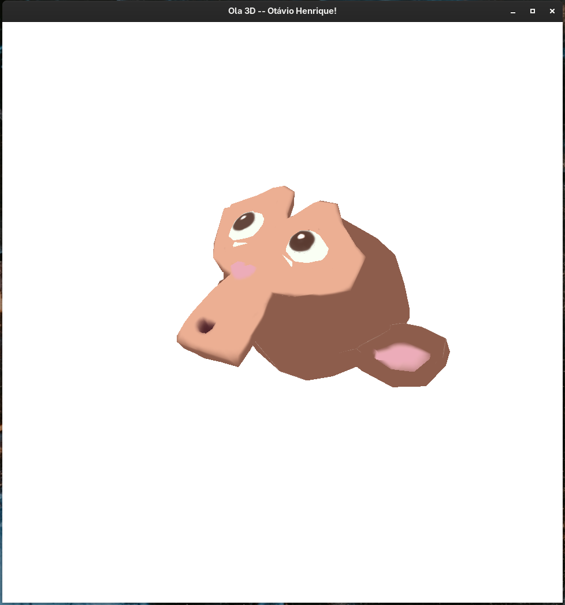

# Arquivo de Entregas

---

# Tarefa 1 - Criando o ambiente de Programação de cenas 3D

# Tarefa 2 - Instanciando objetos na cena 3D

# Tarefa 3 - Carregando obj com mtl

# Vivencial 1 - Carregamento de multiplos objs

